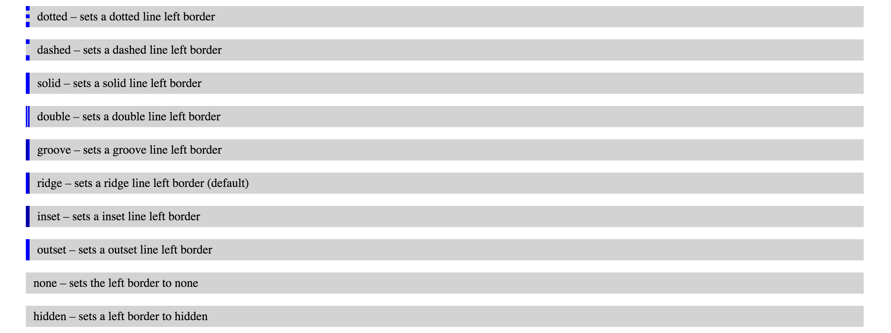

# Border-Left
*The CSS `border-left` property is shorthand that sets and specifies the color, style, and width of and elements left border.*

The border-left property combines the values of `border-left-color`, `border-left-style`, and `border-left-width` properties into one succinct statement to describe and set the left border of an element.  The values of the border-left property can be written in any order and if one or two values are omitted it will set to the default values.  

## Browser Support

|               | Chrome | Firefox | Safari | Opera | IE  |
|:--------------|:------:|:-------:|:------:|:-----:|:---:|
| Basic Support |  1.0   |   1.0   |  3.5   |  1.0  | 4.0 |

## Syntax

The border properites are typcially set in the following: border-width, border-style, and border-color. A example of CSS syntax is below:

```
  border-left: border-left-width border-left-style border-left-color | initial | inherit;
```

### Values

* **border-left-width** - sets the width of the left border. *Default value* is “none”  
* **border-left-style** - sets the style of the left border. *Default value* is “medium”
* **border-left-color** - sets the color of the left border.  *Default value* is the color of the element
* **initial** - sets the property to is default value which is (none medium color of element)
* **inherit** - Inherits values from its parent element

#### Border-left-width
The `border-left-width` sets the width of the left border to display. The values that the border left width can be are as follows.
* **px** – pixels is an angular measurement best known as device pixels
* **pt** – points a physical measurement equal to 1/72 of an inch
* **cm** – centimeter which is equal to 37.8px
* **em** – is a relative unit equal to the font-size of the capital letter “M”
or by using one of the three pre-defined values:
* **thin** – a pre defined value equal to 1px.
* **medium** - a pre defined value equal to 3px
* **thick** - a pre defined value equal to 5px

```
<p class="px">border-left-width 2px</p>
<p class="pt">border-left-width 2pt</p>
<p class="em">border-left-width 2em</p>
<p class="cm">border-left-width 2cm</p>
<p class="thin">border-left-width thin</p>
<p class="medium">border-left-width medium
(default)</p>
<p class="thick">border-left-width thick</p>
```

```
p {
  border-left: red solid;
  padding: 0 10px 0 10px;
}

.px {
  border-left-width: 2px;
}

.pt {
  border-left-width: 2pt;
}

.em {
  border-left-width: 2em;
}

.cm {
  border-left-width: 2cm;
}

.thin {
  border-left-width: thin;
}

.medium {
  border-left-width: medium;
}

.thick {
  border-left-width: thick;
}
```

Example of border-left width

#### border-left-style

The `border-left-style` sets the style of the left border to display.  The following are the different values for the border style  

* **dotted** – sets a dotted line left border
* **dashed** – sets a dashed line left border
* **solid** – sets a solid line left border
* **double** – sets a double line left border
* **groove** – sets a groove line left border
* **ridge** – sets a ridge line left border (default)
* **inset** – sets a inset line left border
* **outset** – sets a outset line left border
* **none** – sets the left border to none
* **hidden** – sets a left border to hidden

CSS:
```
p {
  border-left: blue solid;
  padding: 0 10px 0 10px;
}
.dotted {
  border-left-style: 2px;
}
.dashed {
  border-left-style: dashed;
}
.solid {
  border-left-style: solid;
}
.double {
  border-left-style: double;
}
.groove {
  border-left-style: groove;
}
.ridge {
  border-left-style: ridge;
}
.inset {
  border-left-style: inset;
}
.outset {
  border-left-style: outset;
}
.none {
  border-left-style: none;
}
.hidden {
  border-left-style: hidden;
}
```
RESULTS:
  
Example of border-left-style width  

#### border-left-color
The `border-left-color` sets the color of the left border to display.  The border-left-color default value is the color of the element.  The border color can be set with the following values:

* **name** – sets the color name, "green"
* **hex** – sets the hexidecimal color value, "#00ff00"<
* **RGB** – sets the RGB color value, "rgb(0, 255,0)"
* **transparent** – sets color value to transparent

CSS:
```
p {
  border-left: red solid;
  padding: 0 10px 0 10px;
}

.name {
  border-left-color: green;
}

.hex {
  border-left-color: #00ff00;
}

.rgb {
  border-left-color: rgb(0, 255, 0);
}

.transparent {
  border-left-color: transparent;
}
```

RESULTS:
  
Example of border-left-color width  

## Example 1

In the below example a the left border of the paragraph is set to 10px double #670CE8

HTML:
```
<p class="basic"> border left: 10px double #670CE8</p>
```
CSS:
```
p {
  padding: 10px;
  height: 50px;
  line-height: 50px;
  background-color: lightgrey;
}

.basic {
  border-left: 10px double #670CE8;
}

```
RESULTS:
  
Example of basic border-left property

## Example 2

In the below example you can set the full border for the paragraph and then override the left border with it’s own styling

HTML:
```
<div>
  <p class="basic">
    border: 5px outset darkgray;
    border-left: 10px ridge #E50CE8
  </p>
</div>
```
CSS:
```
p {
  padding: 10px;
  height: 50px;
  line-height: 50px;
  background-color: lightgrey;
  border: 5px outset darkgray;
}

.basic {
  border-left: 10px ridge #E50CE8;
}
```
RESULTS:
  
Example of overriding border with border-left property

## Example 3 - Complex

This is an example in which two borders are set around the paragraph with a different left border set for each border.  One border-left is : 5px solid #f00; and the other border-left is 4px dotted rgb(0, 0, 255);  

HTML:
```
 <div>
  <p class="complex">
    Two borders with border left defined for each border
  </p>
</div>
```

CSS:
```
.complex {
  padding: 20px;
  height: 50px;
  line-height: 50px;
  border: 5px solid #000;
  border-left: 5px solid #f00;
  position: relative;
}

.complex:before {
  content: " ";
  position: absolute;
  z-index: -1;
  top: 5px;
  left: 5px;
  right: 5px;
  bottom: 5px;
  border: 4px solid grey;
  border-left: 4px dotted rgb(0, 0, 255);
}
```

RESULTS:
  
Example of complex border-left property  

## Special Notes

The border-left-color and border-left-width will not be set unless the border-left style property is set.  
